# TraceVault Project Diagrams

These Mermaid diagrams can be previewed directly in Markdown editors that support Mermaid (like GitHub, Notion, or VS Code), or pasted into the [Mermaid Live Editor](https://mermaid.live/).

## Figure 1.5.1 Project Timeline (Gantt Chart)
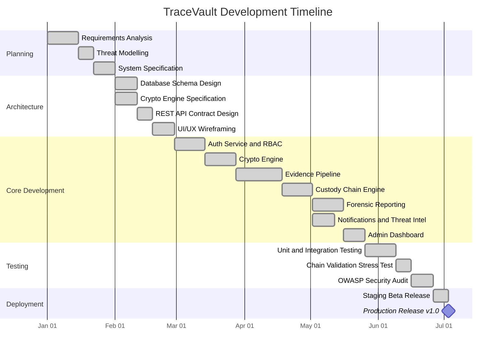

## Figure 3.4.1 System Architecture Diagram
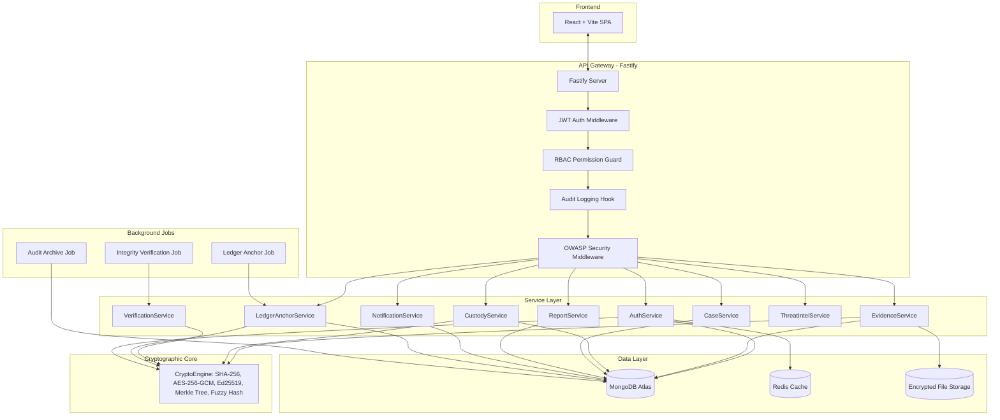

## Figure 4.3.1 Level 0 DFD (Context Diagram)
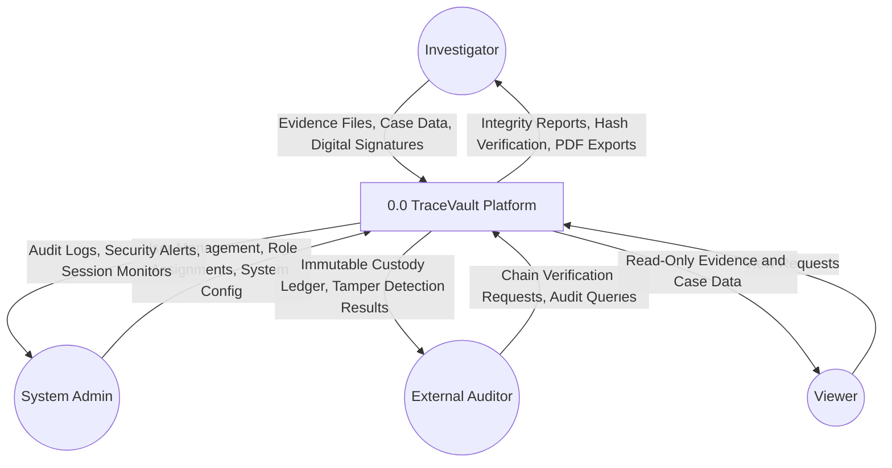

## Figure 4.3.2 Level 1 DFD
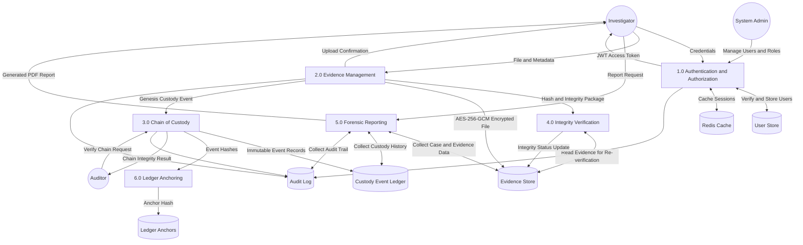

## Figure 4.4.1 Use Case Diagram
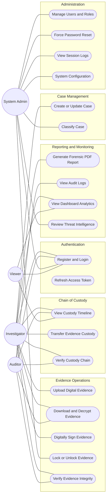

## Figure 4.5.1 Sequence Diagram - Evidence Upload
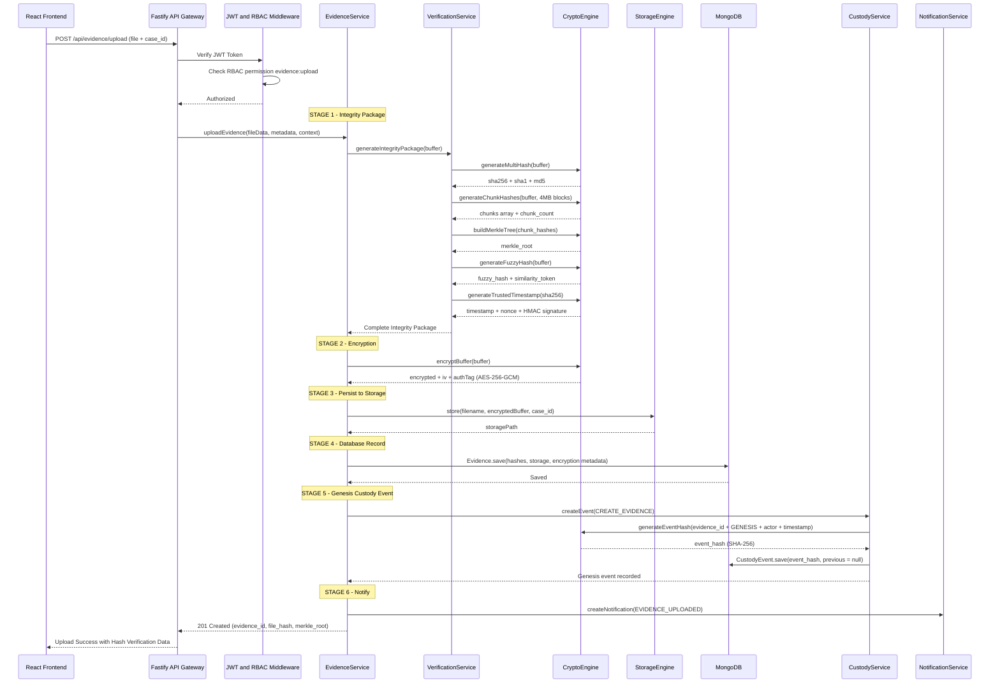

## Figure 4.5.2 Sequence Diagram - Chain of Custody
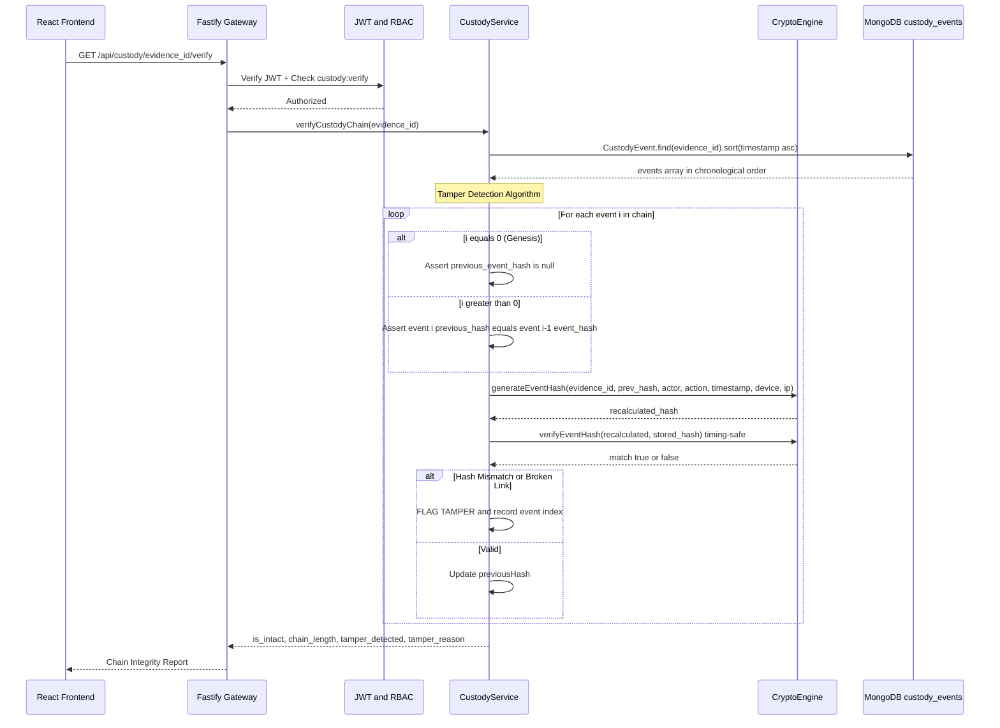

## Figure 4.6.1 Class Diagram
```mermaid
classDiagram
    class User {
        +String user_id
        +String username
        +String email
        +String password_hash
        +String role
        +String full_name
        +String department
        +String badge_number
        +String public_key
        +Boolean is_active
        +String approval_status
        +String classification_clearance
        +Number failed_login_count
        +Date locked_until
        +Date last_login
        +String last_login_ip
        +authenticate()
        +updateProfile()
    }

    class Case {
        +String case_id
        +String case_name
        +String description
        +String created_by
        +String[] investigators
        +String status
        +String priority
        +String classification
        +String case_type
        +String[] tags
        +Number evidence_count
        +Date closed_at
        +addEvidence()
        +classify()
        +archive()
    }

    class Evidence {
        +String evidence_id
        +String case_id
        +String file_name
        +String original_name
        +String mime_type
        +Number file_size
        +String file_hash
        +String hash_sha1
        +String hash_md5
        +Object trusted_timestamp
        +Object[] chunk_hashes
        +Number chunk_count
        +String merkle_root
        +String fuzzy_hash
        +String integrity_status
        +String storage_path
        +String encryption_iv
        +String encryption_auth_tag
        +String encryption_algorithm
        +String uploaded_by
        +String current_custodian
        +Boolean is_locked
        +Date lock_expiry
        +Object[] digital_signatures
        +verifyIntegrity()
        +downloadDecrypted()
        +signEvidence()
        +lockEvidence()
        +transferCustody()
    }

    class CustodyEvent {
        +String event_id
        +String evidence_id
        +String action
        +String actor_id
        +String actor_name
        +String actor_role
        +String previous_event_hash
        +String event_hash
        +String ip_address
        +String device_fingerprint
        +Object geo_location
        +Object details
        +String request_id
        +Date timestamp
    }

    class AuditLog {
        +String log_id
        +String request_id
        +String user_id
        +String user_role
        +String method
        +String endpoint
        +String action
        +Number status_code
        +String ip_address
        +String device_fingerprint
        +String user_agent
        +Number response_time_ms
        +Object geo_location
        +Boolean archived
        +Date timestamp
    }

    class LedgerAnchor {
        +String anchor_id
        +String anchor_date
        +String anchor_hash
        +Number event_count
        +String[] event_hashes
        +String previous_anchor_hash
        +Date created_at
    }

    class EvidenceVersion {
        +String evidence_id
        +Number version_number
        +Object snapshot
        +String changed_by
        +String change_reason
        +Object[] changes
        +Date created_at
    }

    class Notification {
        +String user_id
        +String type
        +String severity
        +String title
        +String description
        +String event_type
        +Object metadata
        +String action_url
        +Number priority_score
        +Boolean read
        +Boolean is_escalated
        +Number group_count
    }

    User "1" -- "*" Case : creates
    Case "1" -- "*" Evidence : contains
    Evidence "1" -- "*" CustodyEvent : tracks
    Evidence "1" -- "*" EvidenceVersion : versions
    User "1" -- "*" CustodyEvent : performs
    User "1" -- "*" AuditLog : generates
    User "1" -- "*" Notification : receives
    CustodyEvent "*" -- "1" LedgerAnchor : anchored daily
```

## Figure 4.8.1 Login Screen Design
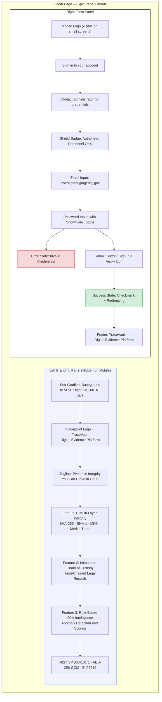

## Figure 4.8.2 Dashboard Design
```mermaid
graph TD
    subgraph Dashboard["Dashboard Page — Apple-Level Clean Design"]
        subgraph Header["Header Section"]
            H_GREET["Greeting: Good morning, Investigator"]
            H_DATE["Date: Monday, April 19, 2026 · 3 uploads today"]
            H_ACTIONS["Quick Buttons: Upload Evidence | New Case"]
        end

        subgraph Stat_Cards["4 Stat Cards (Fade-In Staggered)"]
            SC1["Total Evidence<br/>Count + Weekly Trend"]
            SC2["Verified<br/>Count + Verification Rate %"]
            SC3["Active Cases<br/>Count + Investigating Count"]
            SC4["Audit Events<br/>Count + Today Count"]
        end

        subgraph Alert_Banner["Integrity Alert Banner (Conditional)"]
            ALERT["Warning: X evidence items flagged<br/>with hash mismatch — Review Button"]
        end

        subgraph Main_Grid["Main Content Grid (5-Column)"]
            subgraph Left_Col["Left Column (3/5) — Recent Activity"]
                RA_HEAD["Activity Header + View All"]
                RA1["User Authenticated — 200"]
                RA2["Evidence Uploaded — 201"]
                RA3["Evidence Accessed — 200"]
                RA4["Cases Viewed — 200"]
                RA5["Integrity Verified — 200"]
            end

            subgraph Right_Col["Right Column (2/5)"]
                subgraph EH["Evidence Health Bar Chart"]
                    EH1["Verified — Green Bar"]
                    EH2["Pending — Amber Bar"]
                    EH3["Tampered — Red Bar"]
                end

                subgraph QA["Quick Actions (2x3 Grid)"]
                    QA1["Upload Evidence"]
                    QA2["Verify Integrity"]
                    QA3["Evidence List"]
                    QA4["Chain of Custody"]
                    QA5["Reports"]
                    QA6["Audit Logs"]
                end

                subgraph CL["Cases List"]
                    CL1["Case Name — Status Badge — Time Ago"]
                end

                subgraph TM["Team Members Card"]
                    TM1["Total Users Count"]
                end
            end
        end
    end

    H_GREET --> H_DATE --> H_ACTIONS
    H_ACTIONS --> SC1
    SC1 --> SC2 --> SC3 --> SC4
    SC4 --> ALERT
    ALERT --> RA_HEAD
    RA_HEAD --> RA1 --> RA2 --> RA3 --> RA4 --> RA5
    SC4 --> EH1
    EH1 --> EH2 --> EH3
    EH3 --> QA1
    QA1 --> QA2 --> QA3
    QA4 --> QA5 --> QA6
    QA6 --> CL1 --> TM1

    style Dashboard fill:#fafbfc,stroke:#333,stroke-width:2px
    style Alert_Banner fill:#fff3cd,stroke:#ffc107,stroke-width:1px
    style Stat_Cards fill:#f0f8ff,stroke:#007bff,stroke-width:1px
```

## Figure 6.2.1 Dashboard Screenshot
```mermaid
graph TD
    subgraph Dashboard_Screenshot["Dashboard — Live Application View"]
        subgraph Top_Bar["Application Header"]
            TB_LOGO["Fingerprint Logo — TraceVault"]
            TB_SEARCH["Global Search Bar"]
            TB_THEME["Theme Toggle (Light/Dark)"]
            TB_NOTIF["Notification Bell with Badge"]
            TB_USER["User Avatar + Role"]
        end

        subgraph Sidebar["Navigation Sidebar"]
            NAV1["Dashboard (Active)"]
            NAV2["Evidence"]
            NAV3["Upload"]
            NAV4["Cases"]
            NAV5["Chain of Custody"]
            NAV6["Verify"]
            NAV7["Relationship Graph"]
            NAV8["Reports"]
            NAV9["Audit Logs"]
            NAV10["Threat Intelligence"]
            NAV11["Admin"]
        end

        subgraph Content["Main Content Area"]
            GREET["Good Morning, Ayush"]
            DATE["Monday, April 19, 2026"]

            subgraph Stats_Row["Statistics Cards Row"]
                S1["12 Total Evidence"]
                S2["8 Verified (67%)"]
                S3["3 Active Cases"]
                S4["156 Audit Events"]
            end

            subgraph Activity_Table["Recent Activity Feed"]
                AT1["Evidence Uploaded — 201 — 2m ago"]
                AT2["User Authenticated — 200 — 5m ago"]
                AT3["Custody Transferred — 200 — 12m ago"]
                AT4["Integrity Verified — 200 — 1h ago"]
            end

            subgraph Side_Widgets["Right Side Widgets"]
                SW1["Evidence Health Bars"]
                SW2["Quick Action Grid (6 buttons)"]
                SW3["Cases List (4 recent)"]
                SW4["Team Members Count"]
            end
        end
    end

    TB_LOGO --> TB_SEARCH --> TB_THEME --> TB_NOTIF --> TB_USER
    NAV1 --> NAV2 --> NAV3 --> NAV4 --> NAV5
    NAV5 --> NAV6 --> NAV7 --> NAV8 --> NAV9 --> NAV10 --> NAV11
    GREET --> DATE --> S1
    S1 --> S2 --> S3 --> S4
    S4 --> AT1 --> AT2 --> AT3 --> AT4
    S4 --> SW1 --> SW2 --> SW3 --> SW4

    style Dashboard_Screenshot fill:#09090b,stroke:#27272a,stroke-width:2px,color:#fafafa
    style Top_Bar fill:#0d0d10,stroke:#27272a,stroke-width:1px,color:#fafafa
    style Sidebar fill:#0d0d10,stroke:#27272a,stroke-width:1px,color:#fafafa
    style Stats_Row fill:#1a1a2e,stroke:#3b82f6,stroke-width:1px,color:#fafafa
```

## Figure 6.2.2 Evidence Upload Interface
```mermaid
graph TD
    subgraph Upload_Page["Evidence Upload Interface"]
        subgraph Page_Header["Page Header"]
            UH1["Title: Upload Evidence"]
            UH2["Subtitle: Files are hashed SHA-256, encrypted AES-256-GCM,<br/>and stored with full chain of custody"]
        end

        subgraph Security_Banner["End-to-End Evidence Security Banner"]
            SB_ICON["Shield Icon"]
            SB_PIPELINE["SHA-256 Integrity Hash → AES-256-GCM Encryption<br/>→ Immutable Audit Log → Blockchain Anchoring"]
        end

        subgraph Drop_Zone["Drag and Drop Zone"]
            DZ_ICON["Upload Cloud Icon (56px)"]
            DZ_TEXT["Drag and drop evidence file"]
            DZ_BROWSE["or browse files"]
            DZ_LIMIT["All file types supported · Max 500MB"]
        end

        subgraph File_Preview["File Selected State"]
            FP_ICON["File Type Icon (Image/Video/Audio/PDF)"]
            FP_NAME["File Name + Size + Type"]
            FP_REMOVE["Remove Button (X)"]
            FP_HASH["SHA-256 Hash Preview<br/>(computed client-side in real-time)"]
            FP_PROGRESS["Upload Progress Bar<br/>Encrypting and Uploading — X%"]
        end

        subgraph Upload_Form["Upload Configuration Form"]
            UF_CASE["Link to Case (Required)<br/>Select dropdown with all cases"]
            UF_CAT["Category: Documents | Images | Audio<br/>| Video | Forensic Image | Logs | Other"]
            UF_DESC["Description: Context, custody notes,<br/>observations (max 2000 chars)"]
            UF_ACTIONS["Remove File | Upload Evidence Button"]
        end

        subgraph Success_State["Upload Success Overlay"]
            US_ICON["Green Checkmark (56px)"]
            US_TEXT["Evidence Uploaded"]
            US_DESC["File has been hashed, encrypted,<br/>and catalogued"]
        end

        subgraph Pipeline_Card["Evidence Processing Pipeline (Empty State)"]
            PC1["Hash — SHA-256"]
            PC2["Encrypt — AES-256-GCM"]
            PC3["Store — Encrypted S3"]
            PC4["Audit — Immutable Log"]
        end
    end

    UH1 --> UH2 --> SB_ICON
    SB_ICON --> SB_PIPELINE
    SB_PIPELINE --> DZ_ICON --> DZ_TEXT --> DZ_BROWSE --> DZ_LIMIT

    DZ_LIMIT -->|File Selected| FP_ICON
    FP_ICON --> FP_NAME --> FP_REMOVE
    FP_NAME --> FP_HASH --> FP_PROGRESS

    FP_PROGRESS --> UF_CASE --> UF_CAT --> UF_DESC --> UF_ACTIONS

    UF_ACTIONS -->|Success| US_ICON --> US_TEXT --> US_DESC

    DZ_LIMIT -->|No File| PC1 --> PC2 --> PC3 --> PC4

    style Upload_Page fill:#fafbfc,stroke:#333,stroke-width:2px
    style Security_Banner fill:#eff6ff,stroke:#3b82f6,stroke-width:1px
    style Drop_Zone fill:#f8fafc,stroke:#94a3b8,stroke-dasharray:8 4,stroke-width:2px
    style Success_State fill:#d4edda,stroke:#28a745,stroke-width:1px
```

## Figure 6.2.3 Chain of Custody Timeline
```mermaid
graph TD
    subgraph Custody_Page["Chain of Custody — Legal Integrity Layer"]
        subgraph Custody_Header["Page Header"]
            CH1["Title: Chain of Custody"]
            CH_BADGE["Badge: Legal Layer"]
            CH2["Subtitle: Immutable, hash-chained record of<br/>every evidence handling event — court admissible"]
            CH_VERIFY["Button: Verify Chain"]
        end

        subgraph Legal_Notice["Legal Layer Distinction Card"]
            LN_ICON["Lock Icon"]
            LN_TEXT["Legal integrity layer — records are<br/>cryptographically sealed and immutable.<br/>Each event is SHA-256 chained to previous."]
        end

        subgraph Search_Card["Evidence ID Search"]
            SC_LABEL["Evidence ID Input"]
            SC_INPUT["Monospace Input: ev_01HXYZ..."]
            SC_BTN["Load Chain Button"]
        end

        subgraph Integrity_Banner["Chain Integrity Verification Banner"]
            IB_PASS["Chain Integrity: Verified<br/>N events verified — no tampering detected"]
            IB_FAIL["Chain Integrity: Compromised<br/>Tamper detected at event index X"]
            IB_BADGE["Badge: Court-Admissible / Compromised"]
        end

        subgraph Chain_Stats["Statistics Cards (4 columns)"]
            CS1["Chain Events Count"]
            CS2["Unique Actors Count"]
            CS3["Transfers Count"]
            CS4["Integrity: SHA-256 OK / FAIL"]
        end

        subgraph Timeline["Hash Chain Timeline"]
            subgraph Event_1["Genesis Event"]
                E1_DOT["Green Chain Dot"]
                E1_ICON["FileLock2 Icon — Evidence Created"]
                E1_TAG["Genesis Badge"]
                E1_ACTOR["Actor Name + Role"]
                E1_TIME["Timestamp"]
                E1_HASH["Curr hash: abc123..."]
                E1_LOCK["Immutable Lock Badge"]
                E1_STATUS["Verified Badge"]
            end

            subgraph Event_2["Transfer Event"]
                E2_DOT["Violet Chain Dot"]
                E2_ICON["ArrowLeftRight — Custody Transferred"]
                E2_PREV["Prev hash: abc123..."]
                E2_CURR["Curr hash: def456..."]
                E2_TRANSFER["From: Investigator A → Investigator B"]
                E2_IP["Origin IP: 192.168.x.x"]
            end

            subgraph Event_N["Latest Event"]
                EN_DOT["Blue Chain Dot"]
                EN_ICON["Latest Badge"]
                EN_HASHES["Prev + Curr Hash Display"]
            end
        end

        subgraph Vertical_Line["Vertical Gradient Line Connecting All Events"]
            VL["Primary to Border Gradient"]
        end
    end

    CH1 --> CH_BADGE --> CH2 --> CH_VERIFY
    CH_VERIFY --> LN_ICON --> LN_TEXT
    LN_TEXT --> SC_LABEL --> SC_INPUT --> SC_BTN
    SC_BTN --> IB_PASS
    SC_BTN --> IB_FAIL
    IB_PASS --> IB_BADGE
    IB_FAIL --> IB_BADGE
    IB_BADGE --> CS1 --> CS2 --> CS3 --> CS4
    CS4 --> E1_DOT --> E1_ICON --> E1_TAG
    E1_TAG --> E1_ACTOR --> E1_TIME --> E1_HASH --> E1_LOCK --> E1_STATUS
    E1_STATUS --> E2_DOT --> E2_ICON
    E2_ICON --> E2_PREV --> E2_CURR --> E2_TRANSFER --> E2_IP
    E2_IP --> EN_DOT --> EN_ICON --> EN_HASHES
    VL -.->|Connects| E1_DOT
    VL -.->|Connects| E2_DOT
    VL -.->|Connects| EN_DOT

    style Custody_Page fill:#fafbfc,stroke:#333,stroke-width:2px
    style Legal_Notice fill:#fef9e7,stroke:#f59e0b,stroke-width:1px
    style Integrity_Banner fill:#d4edda,stroke:#28a745,stroke-width:1px
    style Event_1 fill:#ecfdf5,stroke:#10b981,stroke-width:1px
    style Event_2 fill:#f5f3ff,stroke:#8b5cf6,stroke-width:1px
    style Event_N fill:#eff6ff,stroke:#3b82f6,stroke-width:1px
```

## Figure 6.2.4 Relationship Graph Visualization
```mermaid
graph TD
    subgraph Graph_Page["Relationship Engine — Force-Directed Graph"]
        subgraph Graph_Header["Header"]
            GH1["Title: RELATIONSHIP ENGINE"]
            GH2["Subtitle: Static Deterministic Analysis ·<br/>Industry-Grade Panning and Zooming"]
            GH_STATS["Badge: N NODES · M LINKS"]
        end

        subgraph Controls["Toolbar Controls"]
            CTRL1["Zoom Out Button (-)"]
            CTRL2["Zoom Level Display (100%)"]
            CTRL3["Zoom In Button (+)"]
            CTRL4["Reset View (Crosshair)"]
            CTRL5["Toggle Fullscreen"]
            CTRL6["Refresh Data"]
        end

        subgraph Canvas["Interactive SVG Canvas"]
            subgraph BG["Background"]
                BG1["Dot Grid Pattern<br/>(scales with zoom)"]
            end

            subgraph Nodes["Node Types (Draggable)"]
                N_USER["Blue Node: User Entity<br/>(User Icon, rounded square)"]
                N_EVIDENCE["Violet Node: Target Evidence<br/>(FileText Icon)"]
                N_CASE["Amber Node: Operation Case<br/>(FolderOpen Icon)"]
                N_IP["Emerald Node: Network Origin<br/>(Share2 Icon)"]
                N_RISK["Red Pulse Node: Risk Alert<br/>(AlertTriangle Badge)"]
            end

            subgraph Edges["Edge Connections"]
                EDGE1["Bezier Curves with Arrowheads"]
                EDGE2["Labeled: UPLOADED, OWNS,<br/>CONNECTED, ASSIGNED"]
                EDGE3["Hover Focus: Active edges brighten,<br/>inactive fade to 5% opacity"]
            end

            subgraph Interactions["User Interactions"]
                INT1["Mouse Wheel: Zoom In/Out"]
                INT2["Click + Drag Canvas: Pan"]
                INT3["Click + Drag Node: Reposition"]
                INT4["Hover Node: Adjacency Focus<br/>(connected nodes highlight,<br/>others blur + grayscale)"]
            end
        end

        subgraph Legend["Legend Overlay (Bottom Left)"]
            L_TITLE["Node Classification"]
            L1["Blue: User Entity"]
            L2["Violet: Target Evidence"]
            L3["Amber: Operation Case"]
            L4["Emerald: Network Origin"]
        end
    end

    GH1 --> GH2 --> GH_STATS
    GH_STATS --> CTRL1 --> CTRL2 --> CTRL3 --> CTRL4 --> CTRL5 --> CTRL6
    CTRL6 --> BG1
    BG1 --> N_USER
    BG1 --> N_EVIDENCE
    BG1 --> N_CASE
    BG1 --> N_IP
    BG1 --> N_RISK
    N_USER --> EDGE1
    N_EVIDENCE --> EDGE1
    EDGE1 --> EDGE2 --> EDGE3
    EDGE3 --> INT1 --> INT2 --> INT3 --> INT4
    L_TITLE --> L1 --> L2 --> L3 --> L4

    style Graph_Page fill:#09090b,stroke:#27272a,stroke-width:2px,color:#fafafa
    style Canvas fill:#0d0d12,stroke:#27272a,stroke-width:1px,color:#fafafa
    style Legend fill:#1a1a2e,stroke:#3b3b5c,stroke-width:1px,color:#fafafa
    style N_RISK fill:#7f1d1d,stroke:#ef4444,stroke-width:2px,color:#fda4af
```

## Figure 6.2.5 Forensic Report Generation
```mermaid
graph TD
    subgraph Reports_Page["Forensic Report Generation"]
        subgraph Report_Header["Page Header"]
            RH1["Title: Reports"]
            RH2["Subtitle: Generate forensic reports,<br/>case summaries, and audit exports"]
        end

        subgraph Report_Stats["Statistics Cards (3 columns)"]
            RS1["Evidence Items Count<br/>(ShieldCheck Icon — Emerald)"]
            RS2["Active Cases Count<br/>(FolderOpen Icon — Blue)"]
            RS3["Report Templates: 3<br/>(FileText Icon — Amber)"]
        end

        subgraph Type_Selection["Select Report Type"]
            subgraph RT1["Evidence Report (Selectable Card)"]
                RT1_ICON["ShieldCheck — Emerald"]
                RT1_DESC["Detailed evidence metadata, hash,<br/>custody chain, and integrity status"]
            end

            subgraph RT2["Case Summary (Selectable Card)"]
                RT2_ICON["FolderOpen — Blue"]
                RT2_DESC["Overview of case details, linked evidence,<br/>and activity timeline"]
            end

            subgraph RT3["Audit Trail (Selectable Card)"]
                RT3_ICON["FileText — Amber"]
                RT3_DESC["Comprehensive audit log export<br/>with timestamps and actor info"]
            end
        end

        subgraph Config_Card["Configuration Panel"]
            subgraph Evidence_Config["Evidence Report Config"]
                EC1["Select Evidence Dropdown"]
                EC2["Export Format: Court-Ready PDF<br/>| Raw JSON Export Package"]
            end

            subgraph Case_Config["Case Report Config"]
                CC1["Select Case Dropdown"]
                CC2["Export Format Selector"]
                CC3["Info: Includes linked evidence,<br/>team members, activity timeline"]
            end

            subgraph Audit_Config["Audit Report Config"]
                AC1["Info: Exports all system events<br/>with timestamps, actors, endpoints"]
            end

            GEN_BTN["Generate and Download Button<br/>(Download Icon)"]
        end

        subgraph Footer_Note["Footer"]
            FN["Reports can be generated as court-ready<br/>PDF documents or JSON data packages"]
        end
    end

    RH1 --> RH2
    RH2 --> RS1 --> RS2 --> RS3

    RS3 --> RT1_ICON --> RT1_DESC
    RS3 --> RT2_ICON --> RT2_DESC
    RS3 --> RT3_ICON --> RT3_DESC

    RT1_DESC -->|Selected| EC1 --> EC2
    RT2_DESC -->|Selected| CC1 --> CC2 --> CC3
    RT3_DESC -->|Selected| AC1

    EC2 --> GEN_BTN
    CC3 --> GEN_BTN
    AC1 --> GEN_BTN

    GEN_BTN --> FN

    style Reports_Page fill:#fafbfc,stroke:#333,stroke-width:2px
    style RT1 fill:#ecfdf5,stroke:#10b981,stroke-width:1px
    style RT2 fill:#eff6ff,stroke:#3b82f6,stroke-width:1px
    style RT3 fill:#fffbeb,stroke:#f59e0b,stroke-width:1px
    style Config_Card fill:#f8fafc,stroke:#94a3b8,stroke-width:1px
```
